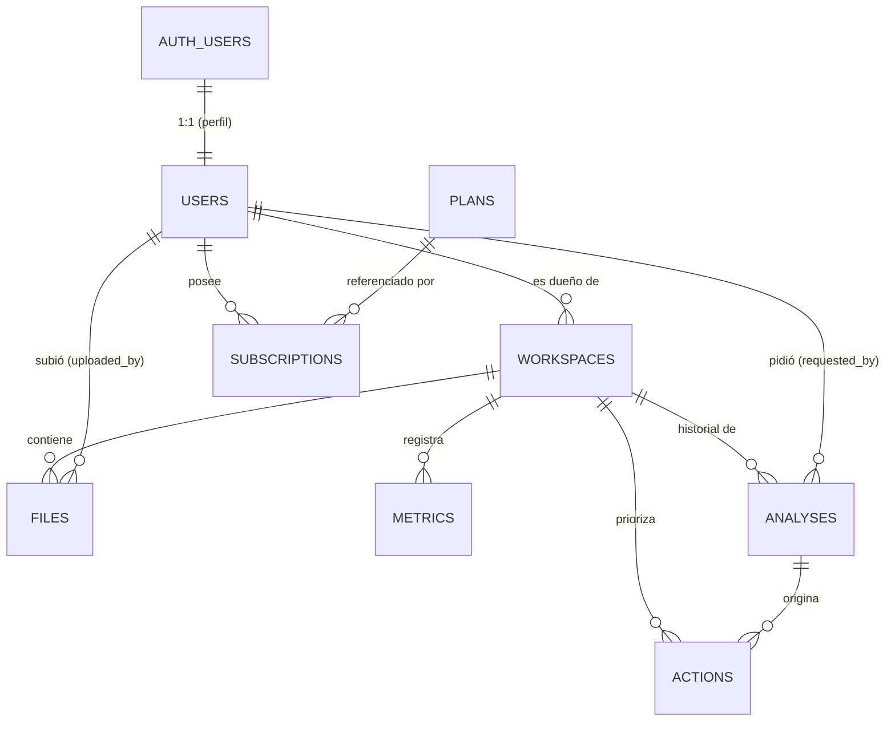

# Modelo de datos — MVP

Motor: **PostgreSQL (Supabase)**. Autenticación: **Supabase Auth**.
Esquema ejecutable: [`../backend/db/schema.sql`](../backend/db/schema.sql).

Alineado con la especificación funcional de Semana 1 (Matu):
`semana_1_matu_producto_investigacion_qa.pdf` — planes Gratuito/Pro,
campos del workspace (FR-03 / 3.1), contrato de IA (sección 4),
métricas (sección 5) y acciones priorizadas del dashboard.

## Diagrama



## Regla de propiedad (aislamiento entre emprendimientos)

Todo dato de un emprendimiento se puede rastrear hasta su dueño:

```
files.workspace_id    ─┐
metrics.workspace_id  ─┤
analyses.workspace_id ─┼─► workspaces.id ─► workspaces.owner_user_id ─► users.id
actions.workspace_id  ─┘
```

El backend valida **`user_id` + `workspace_id`** en cada consulta y no confía en
el identificador que manda la app (QA-042/043/044). Una solicitud con un
`workspace_id` ajeno responde 403/404 sin filtrar si existe. Las políticas RLS
reflejan la misma regla como segunda barrera.

## Tablas

### `plans` — catálogo de planes y límites — **CONGELADO** (Semana 2)
**Gratuito / Pro.** Los knobs viven acá; la app solo los consulta, no los duplica.
`NULL` en un límite = sin tope. **Unidades decimales:** 1 MB = 1.000.000 bytes,
1 GB = 1.000 MB. Storage y análisis se cuentan por **cuenta**, entre todos los
emprendimientos.

| Columna | Tipo | Notas |
|---|---|---|
| `id` | text (PK) | `free` \| `pro` |
| `name` | text | "Gratuito" / "Pro" |
| `price_cents` | integer | mensual (paywall, pago simulado) |
| `max_workspaces` | integer | |
| `max_storage_mb` | integer | total de la cuenta |
| `max_file_mb` | integer | tamaño máximo por archivo |
| `max_analyses_preview_monthly` | integer | vistas previas de IA por mes (NULL = incluida) |
| `max_analyses_full_monthly` | integer | análisis completos por mes |
| `history_months` | integer | meses de historial visibles (1 = solo la última vista previa) |
| `features` | jsonb | `dashboard` (`resumen`\|`completo`), `analisis_completo` (bool) |

Valores:

| | Gratuito | Pro |
|---|---|---|
| Precio mensual | USD 0 | USD 9,99 |
| Workspaces | 1 | 5 |
| Almacenamiento | 50 MB | 1 GB |
| Máx. por archivo | 10 MB | 10 MB |
| Análisis completos/mes | 0 | 20 |
| Vista previa/mes | 1 | incluida |
| Historial | última vista previa | 12 meses |

Reglas de cuota (Semana 2): solo consumen los análisis **completados y guardados**
(los fallidos y consultar resultados guardados no). Reinicio: mes calendario UTC,
sin acumulación. Paso a Pro: conserva el consumo del mes y amplía a 20.

**Enforcement en el MVP:** `max_workspaces`, `max_storage_mb` (sumando los
workspaces del usuario), `max_file_mb`, tipos de archivo (**PDF, DOCX, TXT, CSV**),
cuota de análisis completos y el gate de análisis completo (Gratuito → paywall).

### `users` — perfil de la app (1:1 con `auth.users`)
| Columna | Tipo | Notas |
|---|---|---|
| `id` | uuid (PK, FK) | = `auth.users.id`, `on delete cascade` |
| `email` | text | espejo del email de Auth |
| `full_name` | text | opcional |
| `created_at` / `updated_at` | timestamptz | `updated_at` por trigger |

Al registrarse un usuario en Auth, el trigger `handle_new_user` crea la fila en
`users` y una suscripción `free` activa.

### `subscriptions` — plan del usuario (fuente de verdad)
| Columna | Tipo | Notas |
|---|---|---|
| `id` | uuid (PK) | |
| `user_id` | uuid (FK) | → `users.id` |
| `plan_id` | text (FK) | → `plans.id` |
| `status` | text | `active` \| `trialing` \| `canceled` \| `expired` |
| `is_simulated` | boolean | `true` en el MVP (pago simulado) |
| `started_at` / `current_period_end` | timestamptz | |

Índice único parcial: **una sola suscripción `active` por usuario** → la
activación (`POST /subscription/activate-demo`) es idempotente (doble tap = 1 Pro).
Plan efectivo → vista `user_current_plan` (sin suscripción activa = `free`).

Reglas de cambio de plan (backend):
- **Subir:** los nuevos límites se activan una vez; operación idempotente.
- **Bajar:** no se borran datos. Si la cuenta excede el nuevo límite de storage
  puede consultar y descargar, pero no subir hasta liberar espacio. Si excede el
  número de workspaces, quedan todos en lectura y el usuario elige cuáles activar
  *(en el MVP no hay pantalla de baja; alcanza con no dejar crear nuevos)*.
- **Cancelar:** conserva el nivel pago hasta `current_period_end`.

### `workspaces` — el emprendimiento (FR-03 / 3.1)
| Columna | Tipo | Regla |
|---|---|---|
| `id` | uuid (PK) | |
| `owner_user_id` | uuid (FK) | → `users.id`, `on delete cascade` |
| `name` | text | obligatorio, 2-80 caracteres |
| `country` | text | país |
| `city` | text | ciudad/área, 2-100 caracteres |
| `category` | text | catálogo + opción "Otro" |
| `stage` | text | `idea` \| `lanzamiento` \| `ventas` \| `crecimiento` |
| `offer` | text | oferta principal, 10-500 |
| `target_audience` | text | cliente objetivo, 10-500 |
| `objective_90d` | text | `ventas` \| `alcance` \| `consultas` \| `clientes` \| `validacion` \| `otro` — alimenta la estimación |
| `objective_90d_note` | text | 2-100 caracteres; **obligatorio si `objective_90d = 'otro'`** |
| `current_sales_value` / `current_sales_period` / `currency` | numeric / text / text | ventas o consultas actuales (opcional) |
| `website_url` | text | opcional |
| `instagram_handle` | text | opcional |
| `instagram_account_type` | text | `personal` \| `profesional` \| `desconocido` |
| `instagram_connection_status` | text | `no_conectada` \| `conectada` \| `permiso_faltante` \| `error` |
| `deleted_at` | timestamptz | **eliminación lógica** (`NULL` = activo) |
| `created_at` / `updated_at` | timestamptz | `updated_at` por trigger |

### `files` — archivos del workspace (Supabase Storage)
| Columna | Tipo | Notas |
|---|---|---|
| `id` | uuid (PK) | |
| `workspace_id` | uuid (FK) | → `workspaces.id`, `on delete cascade` |
| `uploaded_by` | uuid (FK) | → `users.id`, `on delete set null` |
| `name` | text | nombre original mostrado |
| `mime_type` / `size_bytes` | text / bigint | `size_bytes` para el límite de plan |
| `storage_path` | text | clave **no predecible** dentro del bucket (UUID, no el nombre) |
| `process_status` | text | `pendiente` \| `procesando` \| `procesado` \| `fallido` |
| `extracted_text` | text | texto extraído para el contexto de IA |
| `metadata` | jsonb | |

### `metrics` — métricas del dashboard (sección 5)
| Columna | Tipo | Notas |
|---|---|---|
| `id` | uuid (PK) | |
| `workspace_id` | uuid (FK) | → `workspaces.id`, `on delete cascade` |
| `metric_type` | text | `alcance` \| `vistas` \| `interacciones` \| `tasa_interaccion` \| `seguidores` \| `visitas_perfil` \| `consultas` \| `clientes` \| `pedidos` \| `ventas_importe` \| `conversion` |
| `value` | numeric | `NULL` si `status <> 'ok'`. Enteros no negativos salvo importes |
| `currency` | text | solo para `ventas_importe` (ISO 4217) |
| `period_start` / `period_end` | timestamptz | período al que corresponde |
| `recorded_at` | timestamptz | cuándo se registró/actualizó |
| `source` | text | `manual` \| `instagram` \| `calculada` \| `analysis` \| `import` \| `simulada` |
| `status` | text | `ok` \| `sin_datos` \| `permiso_faltante` \| `error` — **"sin datos" no es 0** |

Constraint: si `status = 'ok'`, `value` no puede ser `NULL`.

### `analyses` — historial de análisis con IA (contrato sección 4)

**Semana 2:** todo análisis se **genera y guarda completo**. Lo que cambia por
plan es qué se **entrega**: Gratuito ve la vista previa; Pro ve el resultado
completo sin re-ejecutar IA ni consumir otro cupo. **1 análisis activo
(`pendiente`/`procesando`) por cuenta.** Solo consumen cuota los completados y
guardados (fallidos y re-consultas no).

| Columna | Tipo | Notas |
|---|---|---|
| `id` | uuid (PK) | |
| `workspace_id` | uuid (FK) | → `workspaces.id`, `on delete cascade` |
| `requested_by` | uuid (FK) | → `users.id`, `on delete set null` |
| `kind` | text | `vista_previa` \| `completo` (siempre se genera completo; el valor refleja qué se entregó) |
| `consume_cupo` | boolean | `false` en fallidos y re-consultas |
| `objective` | text | `objective_90d` del workspace al momento de correr |
| `status` | text | `pendiente` \| `procesando` \| `completada` \| `fallida` |
| `context_quality` | text | `completo` \| `parcial` \| `insuficiente` |
| `input` | jsonb | contexto enviado a la IA |
| `result` | jsonb | salida estructurada (ver abajo) — validada antes de guardar |
| `projection` | jsonb | `escenario_90_dias` **cualitativo** bajo/base/alto. Sin porcentajes ni montos futuros |
| `sources` | jsonb | lista: título, url, fecha, afirmación respaldada |
| `model` / `prompt_version` | text | trazabilidad de la generación |
| `error` | text | si `status = fallida` |
| `created_at` / `completed_at` | timestamptz | |

Esquema implementado de `result` (sección 4.3 de la spec, ajustado por Semana 2
y por la implementación de Semana 3 — `backend/src/ia/esquemaAnalisis.js`):

```json
{
  "resumen": "80-120 palabras",
  "calidad_contexto": "completo | parcial | insuficiente",
  "fortalezas": [{ "texto": "…", "evidencia": "…" }],
  "riesgos": [{ "texto": "…", "probabilidad": "alta|media|baja", "impacto": "alto|medio|bajo", "mitigacion": "…" }],
  "oportunidades": [{ "texto": "…", "relevancia": "…", "fuente": "…" }],
  "acciones_30_dias": [{ "accion": "…", "motivo": "…", "impacto": "alto|medio|bajo", "esfuerzo": "alto|medio|bajo", "metrica": "…" }],
  "escenario_90_dias": { "nivel": "bajo|base|alto", "supuestos": [], "limitaciones": [] },
  "fuentes": [{ "titulo": "…", "url": "…", "fecha": "…", "afirmacion": "…" }],
  "advertencias": ["límites, datos ausentes, carácter no garantizado"]
}
```

`fortalezas`/`riesgos`/`oportunidades` van **exactamente 3** cada uno,
`acciones_30_dias` **exactamente 3**. Forzado por `responseSchema` de Gemini +
una validación de negocio (`validarResultado`) que reintenta una vez si falla.

**Decisión:** se sacó `metricas` de lo que genera la IA (a diferencia del
listado original de Matu) — pedirle al modelo que "recite" números es riesgo
de invención; el dashboard sirve las métricas reales directo de la tabla
`metrics`, no desde `result`. `fuentes` queda vacío mientras no haya búsqueda
web integrada (Paso 6 de Semana 3).

Estimación **100% cualitativa** (Semana 2): bajo/base/alto con supuestos y
limitaciones, sin porcentajes ni montos futuros. Los datos actuales sí se
muestran como números. Se evita implementar un modelo de proyección numérica
antes del 23/09.

**Contenido gratuito exacto:** resumen + 1 fortaleza + 1 riesgo + 1 oportunidad +
escenario cualitativo con limitaciones. No las 3 acciones ni el análisis completo.

### `actions` — acciones priorizadas del dashboard (IA + usuario)
| Columna | Tipo | Notas |
|---|---|---|
| `id` | uuid (PK) | |
| `workspace_id` | uuid (FK) | → `workspaces.id`, `on delete cascade` |
| `analysis_id` | uuid (FK) | → `analyses.id`, `on delete set null` — análisis que la originó |
| `title` | text | qué hacer |
| `reason` | text | por qué |
| `impact` / `effort` | text | `alto` \| `medio` \| `bajo` |
| `target_metric` | text | qué métrica observar |
| `status` | text | `pendiente` \| `en_curso` \| `hecha` — editable por el usuario |
| `position` | integer | orden sugerido (1 = más prioritaria) |
| `created_at` / `updated_at` | timestamptz | `updated_at` por trigger |

## Row Level Security (resumen)

RLS activado en todas las tablas. El backend usa la **service role key** y saltea
RLS (autoriza en Express); las políticas son la segunda barrera.

| Tabla | Política |
|---|---|
| `plans` | lectura para cualquier autenticado |
| `users` | cada quien lee/edita su propia fila (`id = auth.uid()`) |
| `subscriptions` | cada quien lee las suyas; las escribe el backend |
| `workspaces` | acceso total solo si `owner_user_id = auth.uid()` |
| `files` / `metrics` / `analyses` / `actions` | acceso si el `workspace_id` pertenece al usuario (`is_workspace_owner`) |

## Correspondencia con el contrato de API (guía, sección 5)

| Endpoint | Tablas que toca |
|---|---|
| `POST /auth/register` / `login` | `auth.users` (+ trigger → `users`, `subscriptions`) |
| `GET /me` | `users`, `user_current_plan` |
| `GET/POST/PATCH/DELETE /workspaces` | `workspaces` (DELETE = set `deleted_at`) |
| `POST /workspaces/:id/files` | `files` (+ Storage), chequea `plans.max_storage_mb` |
| `GET /workspaces/:id/dashboard` | `metrics`, `actions`, último `analyses` |
| `POST /workspaces/:id/analyze` | `analyses`, `actions`, chequea límites de `plans` |
| `GET /workspaces/:id/analyses` | `analyses` (recorta a `plans.history_months`) |
| `PATCH /workspaces/:id/actions/:actionId` | `actions` (cambiar `status`) |
| `POST /subscription/activate-demo` | `subscriptions` (idempotente) |
