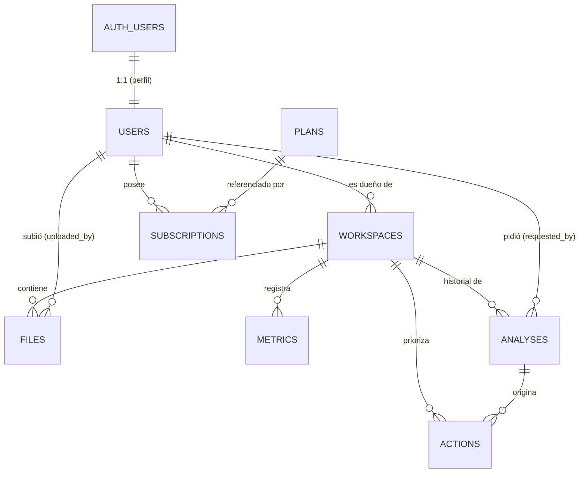

# Modelo de datos — MVP

Motor: **PostgreSQL (Supabase)**. Autenticación: **Supabase Auth**.
Esquema ejecutable: [`../backend/db/schema.sql`](../backend/db/schema.sql).

Alineado con la especificación funcional de Semana 1 (Matu):
`semana_1_matu_producto_investigacion_qa.pdf` — planes Gratuito/Pro,
campos del workspace (FR-03 / 3.1), contrato de IA (sección 4),
métricas (sección 5) y acciones priorizadas del dashboard.

## Diagrama



## Regla de propiedad (aislamiento entre emprendimientos)

Todo dato de un emprendimiento se puede rastrear hasta su dueño:

```
files.workspace_id    ─┐
metrics.workspace_id  ─┤
analyses.workspace_id ─┼─► workspaces.id ─► workspaces.owner_user_id ─► users.id
actions.workspace_id  ─┘
```

El backend valida **`user_id` + `workspace_id`** en cada consulta y no confía en
el identificador que manda la app (QA-042/043/044). Una solicitud con un
`workspace_id` ajeno responde 403/404 sin filtrar si existe. Las políticas RLS
reflejan la misma regla como segunda barrera.

## Tablas

### `plans` — catálogo de planes y límites
**Gratuito / Business / Pro** (actualización de producto:
`actualizacion_planes_y_almacenamiento.pdf`). Todos los knobs viven acá; la app
solo los consulta, no los duplica. `NULL` en un límite = sin tope. Los precios y
números son placeholders hasta validarlos con usuarios y definir el proveedor de IA.

| Columna | Tipo | Notas |
|---|---|---|
| `id` | text (PK) | `free` \| `business` \| `pro` |
| `name` | text | "Gratuito" / "Business" / "Pro" |
| `price_cents` / `price_annual_cents` | integer | mensual (paywall, pago simulado) / anual sugerido |
| `max_workspaces` | integer | |
| `max_collaborators_per_workspace` | integer | 0 = solo propietario (**multiusuario es backlog**) |
| `max_storage_mb` | integer | total de la **cuenta**, repartido entre workspaces |
| `max_file_mb` | integer | tamaño máximo por archivo |
| `max_analyses_preview_monthly` | integer | vistas previas de IA por mes (NULL = incluida) |
| `max_analyses_full_monthly` | integer | análisis completos por mes |
| `max_searches_monthly` | integer | búsquedas / investigaciones web por mes |
| `history_months` | integer | meses de historial visibles (1 = solo el último) |
| `max_instagram_accounts` | integer | cuentas de Instagram conectables |
| `features` | jsonb | `dashboard`, `instagram`, `search`, `export`, `support` (cualitativos) |

Valores iniciales:

| | Gratuito | Business | Pro |
|---|---|---|---|
| Precio mensual | USD 0 | USD 9,99 | USD 19,99 |
| Precio anual | — | USD 99 | USD 199 |
| Workspaces | 1 | 3 | 10 |
| Colaboradores/ws | 0 | 2 | 5 |
| Almacenamiento | 500 MB | 5 GB | 25 GB |
| Máx. por archivo | 10 MB | 25 MB | 50 MB |
| Análisis completos/mes | 0 | 15 | 50 |
| Vista previa/mes | 1 | incluida | incluida |
| Búsquedas/mes | 0 (muestra) | 15 | 50 |
| Historial | 1 mes | 6 meses | 24 meses |
| Cuentas Instagram | 1 | 3 | 10 |

**Enforcement en el MVP** (recorrido de demo): `max_workspaces`, `max_storage_mb`
(sumando los workspaces del usuario), `max_file_mb`, tipos de archivo permitidos
(PDF, DOCX, XLSX, CSV, JPG, PNG) y el gate de análisis completo (Gratuito no puede →
paywall). **Backlog** (no se valida todavía): colaboradores/multiusuario,
contadores mensuales de análisis/búsquedas y su reset, papelera con retención de
30 días, dedup por hash, varias cuentas de Instagram, exportaciones, precios
anuales y el plan Founder / pago único.

### `users` — perfil de la app (1:1 con `auth.users`)
| Columna | Tipo | Notas |
|---|---|---|
| `id` | uuid (PK, FK) | = `auth.users.id`, `on delete cascade` |
| `email` | text | espejo del email de Auth |
| `full_name` | text | opcional |
| `created_at` / `updated_at` | timestamptz | `updated_at` por trigger |

Al registrarse un usuario en Auth, el trigger `handle_new_user` crea la fila en
`users` y una suscripción `free` activa.

### `subscriptions` — plan del usuario (fuente de verdad)
| Columna | Tipo | Notas |
|---|---|---|
| `id` | uuid (PK) | |
| `user_id` | uuid (FK) | → `users.id` |
| `plan_id` | text (FK) | → `plans.id` |
| `status` | text | `active` \| `trialing` \| `canceled` \| `expired` |
| `is_simulated` | boolean | `true` en el MVP (pago simulado) |
| `started_at` / `current_period_end` | timestamptz | |

Índice único parcial: **una sola suscripción `active` por usuario** → la
activación (`POST /subscription/activate-demo`) es idempotente (doble tap = 1 Pro).
Plan efectivo → vista `user_current_plan` (sin suscripción activa = `free`).

Reglas de cambio de plan (backend):
- **Subir:** los nuevos límites se activan una vez; operación idempotente.
- **Bajar:** no se borran datos. Si la cuenta excede el nuevo límite de storage
  puede consultar y descargar, pero no subir hasta liberar espacio. Si excede el
  número de workspaces, quedan todos en lectura y el usuario elige cuáles activar
  *(backlog: en el MVP alcanza con no dejar crear nuevos)*.
- **Cancelar:** conserva el nivel pago hasta `current_period_end`.

### `workspaces` — el emprendimiento (FR-03 / 3.1)
| Columna | Tipo | Regla |
|---|---|---|
| `id` | uuid (PK) | |
| `owner_user_id` | uuid (FK) | → `users.id`, `on delete cascade` |
| `name` | text | obligatorio, 2-80 caracteres |
| `country` / `city` | text | país y ciudad/área |
| `category` | text | catálogo + opción "Otro" |
| `stage` | text | `idea` \| `lanzamiento` \| `ventas` \| `crecimiento` |
| `offer` | text | oferta principal, 10-500 |
| `target_audience` | text | cliente objetivo, 10-500 |
| `objective_90d` | text | `ventas` \| `alcance` \| `consultas` \| `validacion` \| `otro` — alimenta la estimación |
| `objective_90d_note` | text | detalle libre del objetivo |
| `current_sales_value` / `current_sales_period` / `currency` | numeric / text / text | ventas o consultas actuales (opcional) |
| `website_url` | text | opcional |
| `instagram_handle` | text | opcional |
| `instagram_account_type` | text | `personal` \| `profesional` \| `desconocido` |
| `instagram_connection_status` | text | `no_conectada` \| `conectada` \| `permiso_faltante` \| `error` |
| `deleted_at` | timestamptz | **eliminación lógica** (`NULL` = activo) |
| `created_at` / `updated_at` | timestamptz | `updated_at` por trigger |

### `files` — archivos del workspace (Supabase Storage)
| Columna | Tipo | Notas |
|---|---|---|
| `id` | uuid (PK) | |
| `workspace_id` | uuid (FK) | → `workspaces.id`, `on delete cascade` |
| `uploaded_by` | uuid (FK) | → `users.id`, `on delete set null` |
| `name` | text | nombre original mostrado |
| `mime_type` / `size_bytes` | text / bigint | `size_bytes` para el límite de plan |
| `storage_path` | text | clave **no predecible** dentro del bucket (UUID, no el nombre) |
| `process_status` | text | `pendiente` \| `procesando` \| `procesado` \| `fallido` |
| `extracted_text` | text | texto extraído para el contexto de IA |
| `metadata` | jsonb | |

### `metrics` — métricas del dashboard (sección 5)
| Columna | Tipo | Notas |
|---|---|---|
| `id` | uuid (PK) | |
| `workspace_id` | uuid (FK) | → `workspaces.id`, `on delete cascade` |
| `metric_type` | text | `alcance` \| `vistas` \| `interacciones` \| `tasa_interaccion` \| `seguidores` \| `visitas_perfil` \| `consultas` \| `ventas` \| `conversion` |
| `value` | numeric | `NULL` permitido si `status <> 'ok'` |
| `period_start` / `period_end` | timestamptz | período al que corresponde |
| `recorded_at` | timestamptz | cuándo se registró/actualizó |
| `source` | text | `manual` \| `instagram` \| `calculada` \| `analysis` \| `import` \| `simulada` |
| `status` | text | `ok` \| `sin_datos` \| `permiso_faltante` \| `error` — **"sin datos" no es 0** |

Constraint: si `status = 'ok'`, `value` no puede ser `NULL`.

### `analyses` — historial de análisis con IA (contrato sección 4)
| Columna | Tipo | Notas |
|---|---|---|
| `id` | uuid (PK) | |
| `workspace_id` | uuid (FK) | → `workspaces.id`, `on delete cascade` |
| `requested_by` | uuid (FK) | → `users.id`, `on delete set null` |
| `kind` | text | `vista_previa` \| `completo` |
| `objective` | text | `objective_90d` del workspace al momento de correr |
| `status` | text | `pendiente` \| `procesando` \| `completada` \| `fallida` |
| `context_quality` | text | `completo` \| `parcial` \| `insuficiente` |
| `input` | jsonb | contexto enviado a la IA |
| `result` | jsonb | salida estructurada (ver abajo) — el backend valida el esquema antes de guardar |
| `projection` | jsonb | `escenario_90_dias` (bajo/base/alto). **No** es garantía |
| `sources` | jsonb | lista: título, url, fecha, afirmación respaldada |
| `model` / `prompt_version` | text | trazabilidad de la generación |
| `error` | text | si `status = fallida` |
| `created_at` / `completed_at` | timestamptz | |

Esquema esperado de `result` (sección 4.3 de la spec):

```json
{
  "resumen": "80-120 palabras",
  "calidad_contexto": "completo | parcial | insuficiente",
  "fortalezas": ["3 items: hecho/inferencia + evidencia"],
  "riesgos": ["3 items: probabilidad, impacto, mitigación"],
  "oportunidades": ["3 items: señal, relevancia, fuente"],
  "acciones_30_dias": ["3-5 items: acción, motivo, impacto, esfuerzo, métrica"],
  "metricas": ["valor, período, fuente, estado"],
  "escenario_90_dias": { "nivel": "bajo|base|alto", "rango": [n, n], "supuestos": [], "confianza": "" },
  "fuentes": ["título, url, fecha, afirmación"],
  "advertencias": ["límites, datos ausentes, carácter no garantizado"]
}
```

Regla de estimación: sin línea base → **no** inventar porcentaje; mostrar
potencial cualitativo. Con línea base → rangos bajo/base/alto con supuestos y
confianza. La proyección debe poder reconstruirse desde los valores guardados.

### `actions` — acciones priorizadas del dashboard (IA + usuario)
| Columna | Tipo | Notas |
|---|---|---|
| `id` | uuid (PK) | |
| `workspace_id` | uuid (FK) | → `workspaces.id`, `on delete cascade` |
| `analysis_id` | uuid (FK) | → `analyses.id`, `on delete set null` — análisis que la originó |
| `title` | text | qué hacer |
| `reason` | text | por qué |
| `impact` / `effort` | text | `alto` \| `medio` \| `bajo` |
| `target_metric` | text | qué métrica observar |
| `status` | text | `pendiente` \| `en_curso` \| `hecha` — editable por el usuario |
| `position` | integer | orden sugerido (1 = más prioritaria) |
| `created_at` / `updated_at` | timestamptz | `updated_at` por trigger |

## Row Level Security (resumen)

RLS activado en todas las tablas. El backend usa la **service role key** y saltea
RLS (autoriza en Express); las políticas son la segunda barrera.

| Tabla | Política |
|---|---|
| `plans` | lectura para cualquier autenticado |
| `users` | cada quien lee/edita su propia fila (`id = auth.uid()`) |
| `subscriptions` | cada quien lee las suyas; las escribe el backend |
| `workspaces` | acceso total solo si `owner_user_id = auth.uid()` |
| `files` / `metrics` / `analyses` / `actions` | acceso si el `workspace_id` pertenece al usuario (`is_workspace_owner`) |

## Correspondencia con el contrato de API (guía, sección 5)

| Endpoint | Tablas que toca |
|---|---|
| `POST /auth/register` / `login` | `auth.users` (+ trigger → `users`, `subscriptions`) |
| `GET /me` | `users`, `user_current_plan` |
| `GET/POST/PATCH/DELETE /workspaces` | `workspaces` (DELETE = set `deleted_at`) |
| `POST /workspaces/:id/files` | `files` (+ Storage), chequea `plans.max_storage_mb` |
| `GET /workspaces/:id/dashboard` | `metrics`, `actions`, último `analyses` |
| `POST /workspaces/:id/analyze` | `analyses`, `actions`, chequea límites de `plans` |
| `GET /workspaces/:id/analyses` | `analyses` (recorta a `plans.history_months`) |
| `PATCH /workspaces/:id/actions/:actionId` | `actions` (cambiar `status`) |
| `POST /subscription/activate-demo` | `subscriptions` (idempotente) |
